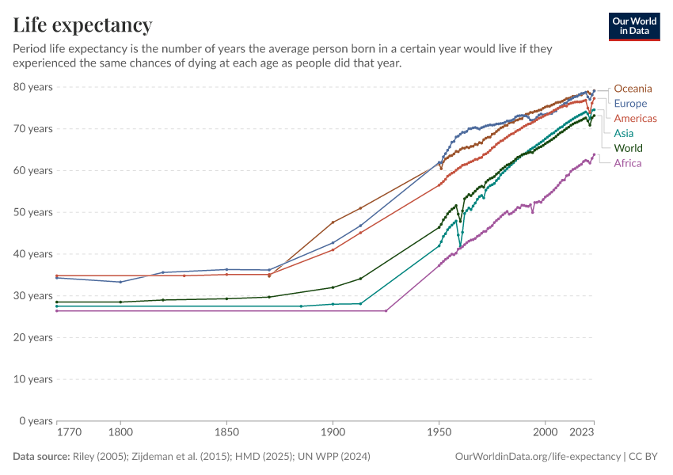
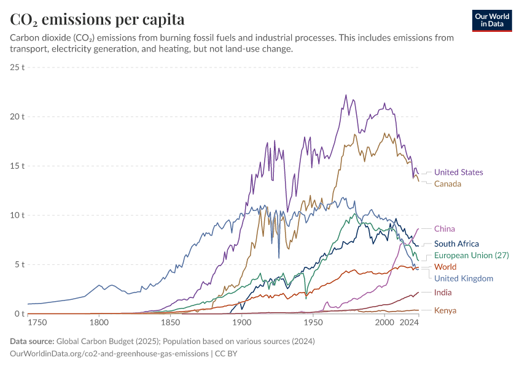
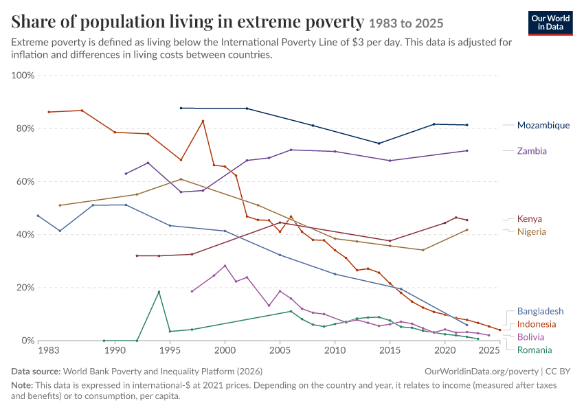

# Informe Final — Evaluación Sumativa Unidad 1

**Visualización de Datos**
**Estudiante:** Gabriel Rojas
**Fecha:** Septiembre de 2026

---

# Parte II — Análisis Crítico de Visualizaciones Reales

## Visualización 1 — Esperanza de vida al nacer (Our World in Data)

### 1. Descripción

- **Fuente:** Our World in Data (ourworldindata.org/life-expectancy), con datos primarios de Riley (2005), Zijdeman et al. (2015), Human Mortality Database (2025) y UN World Population Prospects (2024).
- **Contexto:** gráfico de líneas históricas que cubre el periodo 1770–2023, mostrando la evolución de la esperanza de vida al nacer promedio por continente y a nivel mundial. Es parte de un observatorio de datos internacional de acceso abierto, usado ampliamente por medios, investigadores y organismos internacionales.
- **Audiencia objetivo:** investigadores, periodistas de datos, estudiantes y público general interesado en tendencias globales de desarrollo humano y salud.

### 2. Evaluación Técnica

- **Tipo de gráfico:** gráfico de líneas múltiples (multi-line chart) en serie temporal.
- **Variables representadas:** tiempo (eje X, 1770–2023) y esperanza de vida en años (eje Y), desagregada en seis series (Oceanía, Europa, Américas, Asia, Mundo, África).
- **Calidad de representación:** alta. El eje Y comienza en 0 (buena práctica que evita exagerar visualmente la pendiente de crecimiento), cada serie se etiqueta directamente al final de la línea en vez de usar una leyenda separada, y se cita explícitamente la fuente y la licencia (CC BY).
- **Nivel de complejidad:** medio. Seis series simultáneas son manejables visualmente, aunque la zona 1900–1970 concentra cruces entre líneas que exigen atención del lector.

### 3. Evaluación Crítica

- **Claridad visual:** buena, gracias al etiquetado directo de series (*direct labeling*) y a una grilla horizontal sutil que sirve de referencia sin competir con los datos.
- **Aplicación de buenas prácticas:** cumple varias reglas clásicas de [[Buenas Prácticas]] y [[Codificación Visual]]: eje que parte en cero, colores diferenciables, título que define el indicador ("Period life expectancy is the number of years...") y fuente visible.
- **Posibles problemas de interpretación:** al comprimir 250 años en un solo eje, quiebres recientes importantes —como la caída de la esperanza de vida mundial en 2020-2021 por la pandemia de COVID-19— se perciben como un pliegue casi imperceptible frente a la escala histórica completa, minimizando visualmente un evento demográfico relevante.
- **Posibles sesgos:** la agregación por continente oculta desigualdades internas muy significativas (dentro de "África" o "Asia" existen países con esperanzas de vida muy distintas entre sí); el promedio "Mundo" además puede estar dominado por los países más poblados (China, India), invisibilizando realidades de países pequeños.

### 4. Propuesta de Mejora

- **Qué modificaría:** añadiría una banda sombreada de mínimo-máximo dentro de cada continente, para mostrar la dispersión interna y no solo el promedio.
- **Qué eliminaría:** nada estructural —es un gráfico ya bien optimizado según los principios de [[Percepción Visual]]—, pero acotaría el rango temporal por defecto para el público general, dejando el histórico completo como opción avanzada.
- **Qué agregaría:** un selector interactivo tipo *small multiples* para pasar de la vista agregada por continente a series por país, exponiendo la heterogeneidad interna sin sacrificar la lectura general.
- **Qué visualización utilizaría:** mantendría el gráfico de líneas como base, pero lo complementaría con pequeños múltiplos por país agrupados por continente, aplicando el concepto de [[Comunicación Visual]] para balancear detalle y síntesis.

---

## Visualización 2 — Emisiones de CO₂ per cápita (Our World in Data / Global Carbon Budget)

### 1. Descripción

- **Fuente:** Our World in Data (ourworldindata.org/co2-and-greenhouse-gas-emissions), con datos primarios del Global Carbon Budget (2025).
- **Contexto:** serie temporal 1750–2024 de emisiones de CO₂ per cápita, comparando Estados Unidos, Canadá, China, Sudáfrica, la Unión Europea (27), el mundo, el Reino Unido, India y Kenia.
- **Audiencia objetivo:** formuladores de política climática, periodistas ambientales, negociadores internacionales y ciudadanía informada en el debate sobre cambio climático.

### 2. Evaluación Técnica

- **Tipo de gráfico:** líneas múltiples, serie temporal.
- **Variables representadas:** tiempo vs. toneladas de CO₂ per cápita, por país o bloque (9 series).
- **Calidad de representación:** alta en términos de exactitud de los datos, pero con mayor densidad visual que la visualización anterior.
- **Nivel de complejidad:** medio-alto. El cruce de líneas en la franja de 5 a 10 toneladas dificulta distinguir a simple vista a Sudáfrica, la Unión Europea y el Reino Unido, cuyos colores (verde, azul oscuro, celeste) son visualmente próximos.

### 3. Evaluación Crítica

- **Claridad visual:** se degrada específicamente en la zona de solapamiento de series con colores similares, un problema típico cuando se excede el número recomendado de categorías coloreadas simultáneas (regla general de no superar 6-7 colores categóricos, ver [[Paleta de Color]]).
- **Aplicación de buenas prácticas:** eje en cero, fuente citada, título que aclara el alcance del indicador (excluye cambio de uso de suelo).
- **Posibles problemas de interpretación:** comparar solo el valor per cápita, sin mostrar la población total ni la emisión absoluta, puede llevar a conclusiones incompletas: un país con alta industrialización y baja población puede parecer "peor" que uno con alta emisión total pero baja per cápita.
- **Posibles sesgos:** la selección específica de países mostrados (economías desarrolladas de alto consumo histórico frente a India y Kenia) puede reforzar una narrativa norte-sur sin dar contexto sobre la industrialización histórica acumulada ([[Ética de los Datos y Sesgos]]), ya que las emisiones históricas acumuladas —no solo las actuales— son clave en el debate climático.

### 4. Propuesta de Mejora

- **Qué modificaría:** incorporaría resaltado interactivo (*hover highlight*) que atenúe las demás series al pasar el cursor sobre una, para "despegar" visualmente cada línea en las zonas de alta densidad.
- **Qué eliminaría:** limitaría a 5-6 series visibles por defecto, moviendo el resto a una selección expandible, reduciendo la carga cognitiva inicial.
- **Qué agregaría:** un gráfico complementario de burbujas (emisión total vs. per cápita vs. población), que evite la lectura sesgada de mirar el per cápita de forma aislada.
- **Qué visualización utilizaría:** conservaría las líneas para la tendencia temporal, pero añadiría un *bump chart* o ranking anual que muestre el cambio de posición relativa entre países en años clave, aplicando [[Codificación Visual]] orientada a la comparación de rangos más que de magnitudes absolutas.

---

## Visualización 3 — Población en pobreza extrema (World Bank / Our World in Data)

### 1. Descripción

- **Fuente:** Our World in Data (ourworldindata.org/poverty), con datos primarios de World Bank Poverty and Inequality Platform (2026).
- **Contexto:** serie temporal 1983–2025 del porcentaje de población que vive bajo la línea de pobreza internacional de USD 3 al día (ajustada por poder adquisitivo), para siete países: Mozambique, Zambia, Kenia, Nigeria, Bangladesh, Indonesia, Bolivia y Rumania.
- **Audiencia objetivo:** organismos de cooperación internacional, ONG, académicos de desarrollo y tomadores de decisión de política social.

### 2. Evaluación Técnica

- **Tipo de gráfico:** líneas múltiples.
- **Variables representadas:** tiempo vs. porcentaje de población en pobreza extrema, por país.
- **Calidad de representación:** buena, aunque los datos de cada país cubren rangos temporales distintos (por ejemplo, Mozambique inicia su serie en 1996 y Rumania solo llega hasta comienzos de la década de 2000), generando discontinuidades.
- **Nivel de complejidad:** medio. Siete series con trayectorias muy heterogéneas entre sí.

### 3. Evaluación Crítica

- **Claridad visual:** aceptable, aunque los huecos de datos —representados simplemente como ausencia de línea— pueden confundirse con "cero pobreza" en lugar de "sin medición disponible", un problema de [[Calidad de Datos]] y de comunicación de la incertidumbre.
- **Aplicación de buenas prácticas:** eje 0-100% correctamente anclado, metodología explicitada (dólares internacionales a precios de 2021) y una nota aclaratoria sobre si el dato corresponde a ingreso o a consumo según el país.
- **Posibles problemas de interpretación:** agrupar países con trayectorias, regiones y causas estructurales tan distintas (África subsahariana, Europa del Este, Sudeste asiático, Sudamérica) sin distinguirlos visualmente por región puede sugerir una comparabilidad directa que en realidad no existe.
- **Posibles sesgos:** la selección de exactamente estos siete países no se justifica dentro del propio gráfico, lo que introduce un posible sesgo de selección editorial ([[Ética de los Datos y Sesgos]]) al no explicar el criterio de inclusión/exclusión.

### 4. Propuesta de Mejora

- **Qué modificaría:** colorearía o agruparía los países por región geográfica (código de color por continente), dando contexto interpretativo inmediato al lector.
- **Qué eliminaría:** los tramos sin datos deberían marcarse explícitamente con una línea punteada en vez de simplemente omitirse, evitando la confusión entre "sin dato" y "0%".
- **Qué agregaría:** un mapa coroplético complementario que muestre el dato más reciente disponible por país, ideal para la comparación espacial en un momento dado —tarea para la que una serie de líneas es una herramienta débil frente a un mapa ([[Visualización de Datos]]).
- **Qué visualización utilizaría:** complementaría el gráfico de líneas (útil para tendencia de un subconjunto acotado y justificado de países) con un mapa mundial de pobreza extrema para la comparación entre muchos países en un mismo corte temporal.

---

# Parte III — Reflexión Profesional

## ¿Cómo contribuye la visualización de datos a transformar datos en conocimiento útil para la toma de decisiones en una organización?

La visualización de datos ocupa un lugar particular dentro del ciclo de vida de la información en cualquier organización: no es el origen del proceso —los datos existen antes y de forma independiente de cualquier gráfico— ni tampoco es su destino final —el destino es la decisión que un ser humano toma a partir de lo que comprende—, sino que actúa como el mecanismo de traducción que permite recorrer el camino que separa el dato bruto del conocimiento accionable. Esta idea, que estructura el libro *Visualización de la información: De los datos al conocimiento* de Ignasi Alcalde Perea, y que también organiza el primer eje temático de la bóveda de conocimiento construida para esta evaluación, es el punto de partida para responder por qué la visualización importa tanto en contextos organizacionales.

Para entender esta contribución conviene partir del modelo jerárquico conocido como pirámide DIKW (Datos-Información-Conocimiento-Sabiduría), documentado en la nota [[Pirámide DIKW]] de mi Vault. Los **datos** son la representación simbólica de hechos u observaciones, sin significado propio: una tabla con miles de filas de ventas diarias, temperaturas horarias o transacciones bancarias no dice nada por sí misma hasta que alguien la organiza. Cuando esos datos se estructuran y contextualizan —se agrupan por región, se comparan contra un periodo anterior, se relacionan con un objetivo de negocio— se transforman en **información**. Y cuando esa información es interpretada por una persona con experiencia y criterio, integrándose a su comprensión del negocio o del fenómeno que estudia, se convierte en **conocimiento**: la base real sobre la que se toman decisiones.

La visualización de datos interviene exactamente en la transición entre estos dos últimos peldaños. Su función no es estética sino cognitiva: aprovecha las capacidades de percepción visual del ser humano —que procesa patrones, proporciones y colores mucho más rápido que columnas de números— para acelerar el paso de información a conocimiento. Como quedó documentado en la nota [[Percepción Visual]] de mi bóveda, el ojo humano compara con gran precisión longitudes y posiciones, pero compara mal ángulos y áreas; este hallazgo, proveniente de la psicología cognitiva y la ergonomía visual, es la base científica detrás de reglas de diseño que muchas veces parecen arbitrarias, como preferir gráficos de barras sobre gráficos de torta para comparar magnitudes.

Sin embargo, sostener que "visualizar genera conocimiento" sin matices sería una simplificación peligrosa, y aquí es donde la construcción de esta Vault me permitió conectar ideas que en una lectura lineal del libro podrían quedar separadas. La calidad del conocimiento final depende íntegramente de decisiones tomadas *antes* de que exista cualquier gráfico: de la forma en que se recolectaron los datos ([[Recolección de Datos]]), de si esos datos son íntegros y están libres de errores ([[Integridad de Datos]] y [[Calidad de Datos]]), y de si provienen de fuentes homologadas cuando se combinan distintas bases ([[Homologación de Datos]]). Un gráfico impecable en su diseño, construido sobre datos de mala calidad o mal homologados, no produce conocimiento útil: produce una ilusión de certeza sobre una base falsa. Esta relación cruzada —entre el eje de "calidad de datos" y el eje de "visualización"— es precisamente uno de los enlaces que más reforcé al construir mi mapa conceptual integrador, donde conecté explícitamente conceptos como [[Ética de los Datos y Sesgos]] con [[Buenas Prácticas]] de visualización, ya que ambos son, en el fondo, mecanismos de control de calidad sobre la verdad que finalmente llega al tomador de decisiones.

El análisis crítico de visualizaciones reales realizado en la Parte II de esta evaluación es una evidencia concreta de este punto. Al examinar gráficos publicados por Our World in Data sobre esperanza de vida, emisiones de CO₂ y pobreza extrema, pude comprobar que incluso visualizaciones técnicamente muy bien construidas —con ejes correctamente anclados en cero, fuentes citadas y colores diferenciables— pueden inducir interpretaciones parciales cuando ocultan decisiones previas: qué países se seleccionaron para comparar, qué nivel de agregación se usó (continental versus nacional), o qué franjas de tiempo carecen de datos y por qué. Ninguno de esos gráficos "miente" en sentido estricto, pero todos ellos demuestran que la honestidad de una visualización no depende solo de su forma final, sino de todo el proceso de trabajo con datos que la precede, un concepto que en mi Vault desarrollé en la nota [[Proceso de Trabajo con Datos]].

En el contexto específico de una organización, esta cadena completa —datos, calidad, visualización, comunicación— tiene consecuencias muy prácticas. Un dashboard gerencial mal diseñado, con demasiados indicadores simultáneos o codificaciones visuales poco precisas (como el uso de áreas o colores para representar magnitudes exactas, tema que abordo en mi nota [[Codificación Visual]]), no solo es estéticamente pobre: retrasa decisiones, genera interpretaciones divergentes entre distintos gerentes que miran el mismo panel, y en el peor de los casos, lleva a decisiones equivocadas basadas en una lectura errónea de la magnitud real de un problema. Por el contrario, una visualización bien diseñada —que aplique los principios de [[Diseño de Información]] y [[Comunicación Visual]], que use un tipo de gráfico apropiado según el [[Tipos de Datos|tipo de dato]] representado, y que incorpore [[Storytelling]] cuando el objetivo es persuadir o alinear a un equipo en torno a una conclusión— comprime el tiempo que una organización necesita para pasar de "tener datos" a "actuar con conocimiento".

Finalmente, esta actividad integradora me permitió vivir en carne propia el proceso que describo de forma abstracta. Construir una red de casi treinta notas interconectadas en Obsidian no fue simplemente "resumir" el libro: fue un ejercicio de visualización de mi propio conocimiento, donde el grafo de enlaces cumple exactamente la misma función que un buen dashboard cumple en una organización: revela relaciones entre partes de la información que, leídas de forma lineal, permanecerían invisibles. Ver en el Graph View de Obsidian cómo el nodo "Calidad de Datos" termina conectado, a través de varios saltos, con "Storytelling" o "Usuarios", es una prueba tangible —a pequeña escala personal— de la misma tesis que sostiene el libro de Alcalde Perea: el valor de los datos no está en su acumulación, sino en la calidad de la red de relaciones que somos capaces de construir para transformarlos en conocimiento útil, aplicable y comunicable dentro de una organización.

---

# Parte IV — Gestión del Conocimiento Digital

## ¿Cómo aportan Obsidian y GitHub a la construcción y gestión del conocimiento en proyectos de Ciencia de Datos?

Obsidian y GitHub resuelven dos problemas distintos pero complementarios dentro de un proyecto de ciencia de datos: cómo se organiza el conocimiento conceptual del equipo, y cómo se preserva y audita la evolución técnica del trabajo a lo largo del tiempo.

**Organización del conocimiento.** A diferencia de un documento lineal (Word, Google Docs), Obsidian permite estructurar el conocimiento como una red de notas atómicas interconectadas mediante enlaces internos (`[[wikilinks]]`). En un proyecto de ciencia de datos esto es especialmente valioso porque los conceptos —variables, definiciones de negocio, decisiones de modelado, hallazgos exploratorios— rara vez son jerárquicos puros: una definición de "calidad de dato" se relaciona simultáneamamente con la fuente de origen, con el pipeline de limpieza y con el dashboard final. Un Mapa de Contenido (MOC), como el construido en esta evaluación, actúa como panel de navegación central sin forzar una única taxonomía rígida.

**Trazabilidad del aprendizaje.** El Graph View de Obsidian y el historial de commits de GitHub cumplen, cada uno a su escala, la misma función: hacer visible el proceso, no solo el resultado. En este proyecto, la bitácora de aprendizaje (`VisualizacionDatos_Rojas_Gabriel/Reflexiones`) documenta cómo evolucionó mi comprensión de los conceptos, mientras que el historial de commits documenta cuándo y en qué orden se construyó cada pieza, permitiendo a un evaluador —o a un futuro colaborador— reconstruir el razonamiento detrás de las decisiones tomadas.

**Documentación técnica.** El formato Markdown, nativo en Obsidian y renderizado automáticamente por GitHub, evita la dependencia de herramientas propietarias para documentar decisiones técnicas, definiciones de datos o supuestos de un análisis, manteniendo la documentación versionable como si fuera código.

**Trabajo colaborativo.** Aunque esta evaluación es individual, la combinación Vault + repositorio Git es exactamente el patrón que usan equipos de ciencia de datos reales: cada persona puede trabajar en sus propias notas o ramas, y los conflictos de fusión en archivos de texto plano son mucho más simples de resolver que en documentos binarios.

**Reproducibilidad y gestión de versiones.** Git no solo guarda "la última versión": conserva cada estado intermedio del proyecto. Esto significa que una decisión de análisis puede revertirse, un dato erróneo puede rastrearse hasta el commit donde se introdujo, y el criterio de "no aceptar un único commit final" exigido en esta evaluación no es un capricho académico, sino la misma exigencia que un equipo profesional de datos aplicaría para poder auditar cómo se llegó a una conclusión, garantizando que el conocimiento generado sea reproducible por otra persona distinta a quien lo creó originalmente.

En conjunto, Obsidian aporta la capa de significado y relación entre ideas, mientras que GitHub aporta la capa de control temporal y responsabilidad sobre los cambios. Un proyecto de ciencia de datos que use ambas herramientas de forma disciplinada gana algo que rara vez se prioriza bajo presión de plazos: la capacidad de explicar, meses después, por qué el conocimiento generado dice lo que dice.
