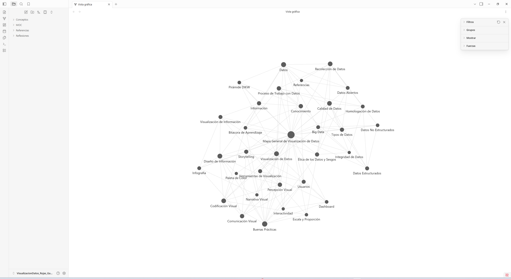

# Visualización de Datos — Evaluación Sumativa Unidad 1

## Información General

- **Nombre del estudiante:** Gabriel Rojas
- **Asignatura:** Visualización de Datos
- **Carrera:** Ingeniería en Informática
- **Fecha:** Septiembre de 2026

## Descripción del Proyecto

Este repositorio contiene la evaluación sumativa de la Unidad 1: *Construcción de una Base de Conocimiento y Análisis Crítico de la Visualización de Datos*. El trabajo integra:

1. **Una base de conocimiento en Obsidian** construida a partir de la lectura de *Visualización de la información: De los datos al conocimiento* (Ignasi Alcalde Perea), con 31 notas conceptuales interconectadas y un Mapa de Contenido (MOC) central.
2. **Un mapa conceptual integrador** (Canvas de Obsidian) con un concepto central, 10 conceptos secundarios, 20 conceptos terciarios y relaciones etiquetadas, incluyendo relaciones cruzadas entre distintas áreas temáticas.
3. **Un análisis crítico de tres visualizaciones reales** publicadas por Our World in Data (esperanza de vida, emisiones de CO₂ per cápita y pobreza extrema), evaluando su descripción, calidad técnica, claridad, sesgos y propuestas de mejora.
4. **Un ensayo reflexivo profesional** sobre cómo la visualización de datos transforma datos en conocimiento útil para la toma de decisiones organizacionales.
5. **Una reflexión técnica** sobre el aporte de Obsidian y GitHub a la gestión del conocimiento en proyectos de ciencia de datos.

## Estructura de la Vault y del Repositorio

```
visualizacion-datos-u1-rojas-gabriel/
├── README.md
├── VisualizacionDatos_Rojas_Gabriel/   # Bóveda de Obsidian (Vault)
│   ├── MOC/                    # Mapa General de Visualización de Datos (nodo central de navegación)
│   ├── Conceptos/               # 31 notas conceptuales (Definición, Resumen Personal, Importancia, Relacionado con)
│   ├── Referencias/              # Fuente bibliográfica y fuentes de datos utilizadas
│   └── Reflexiones/              # Bitácora de aprendizaje del proceso
├── MapaConceptual/
│   ├── MapaConceptual.canvas    # Mapa conceptual integrador (formato nativo Obsidian Canvas)
│   └── MapaConceptual.pdf       # Versión exportada en PDF (Entrega 2)
├── Informe/
│   ├── Informe.md               # Fuente del informe (Parte II, III y IV)
│   └── Informe.pdf              # Informe final exportado (Entrega 3)
├── Evidencias/
│   ├── GraphView.png            # Evidencia del grafo de conocimiento de la Vault
│   ├── HistorialCommits.png     # Evidencia del historial de commits progresivo
│   └── Visualizacion{1,2,3}_*.png  # Capturas reales de las visualizaciones analizadas en la Parte II
└── Recursos/                    # Material de apoyo adicional
```

## Captura del Graph View



> **Nota de trazabilidad:** captura real tomada desde la aplicación Obsidian (v1.13.7), abriendo `VisualizacionDatos_Rojas_Gabriel/` como bóveda. Muestra las 34 notas interconectadas mediante enlaces `[[wikilink]]`, sin nodos aislados.

## Aprendizajes Obtenidos

Construir esta Vault evidenció que la visualización de datos no es una etapa aislada al final de un proyecto, sino el resultado de decisiones tomadas mucho antes: la calidad de los datos, su homologación y la ética de su recolección determinan si el gráfico final comunica conocimiento real o una ilusión de certeza. Organizar el conocimiento como una red de notas interconectadas —en lugar de un documento lineal— permitió descubrir relaciones cruzadas entre conceptos (por ejemplo, entre ética de los datos y buenas prácticas de diseño visual) que no habrían sido evidentes en un resumen tradicional del libro. El detalle completo de esta reflexión se desarrolla en `Informe/Informe.pdf` (Partes III y IV).

## Control de Versiones

El desarrollo de este repositorio se realizó de forma progresiva mediante múltiples commits significativos (ver `Evidencias/HistorialCommits.png` y el historial de `git log`), evitando una entrega mediante un único commit final.
